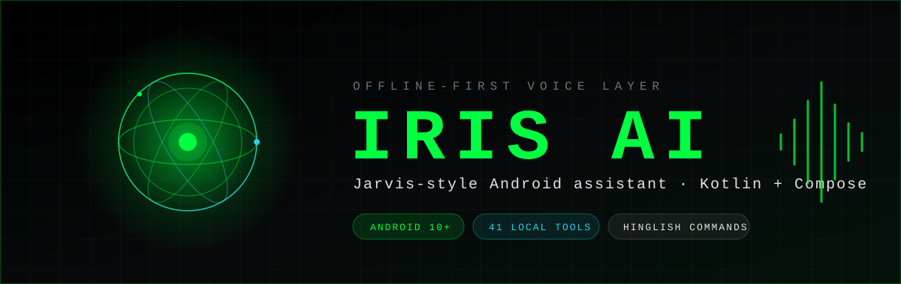
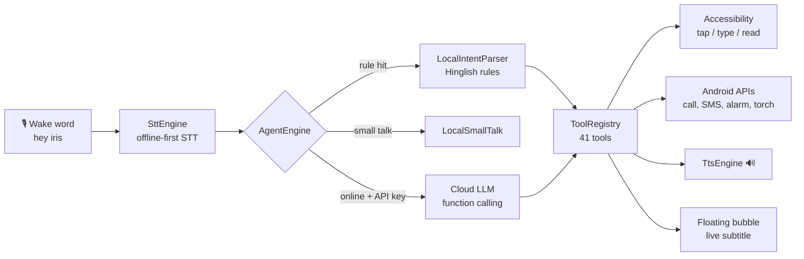

<div align="center">



<h3>Jarvis-style, offline-first voice assistant for Android — Kotlin + Jetpack Compose</h3>
<p><i>Bolo aur ho jaaye.</i> Wake word, Hinglish commands, real device automation — bina internet ke.</p>

<p>


</p>

<p>
<a href="https://github.com/coding-king-sk/IRIS-AI-Android/actions/workflows/android.yml"></a>
<a href="https://github.com/coding-king-sk/IRIS-AI-Android/releases"></a>


</p>

<p>
<a href="#-download"><b>Download</b></a> ·
<a href="#-features"><b>Features</b></a> ·
<a href="#-voice-commands"><b>Commands</b></a> ·
<a href="#-setup-3-minutes"><b>Setup</b></a> ·
<a href="#-roadmap--what-to-add-next"><b>Roadmap</b></a>
</p>

</div>

---

## ⚡ What is this?

Android-native rebuild of [IRISX-AI/IRIS-AI](https://github.com/IRISX-AI/IRIS-AI) (an Electron desktop app) as a real phone assistant — **same dark glassmorphic UI, same `#00ff41` accent, same AI-core orb and command dock** — running natively on **Android 10+** and working **without internet** for everything except optional cloud reasoning.

> Electron / React / Three.js can't run as a native Android app, so this is a ground-up **Kotlin + Compose** rebuild of the same product design. Original desktop concept by Harsh Pandey (IRISX-AI).

```
"hey iris"  →  "Riya ko photo bhejo"
                └→ gallery se latest photo → WhatsApp → contact → SEND ✅
```

---

## 📥 Download

| | |
|---|---|
| **Latest APK** | [Releases](https://github.com/coding-king-sk/IRIS-AI-Android/releases) → `IRIS-AI-v1.0.0-debug.apk` |
| **Every commit build** | [Actions](https://github.com/coding-king-sk/IRIS-AI-Android/actions) → latest run → artifact **iris-ai-debug** |
| **Requirements** | Android 10 (API 29) or newer, ~60 MB |

> Debug-signed sideload hai, isliye **Play Protect** ek warning dikhayega — *More details → Install anyway*. Ye normal hai.

---

## ✨ Features

### 🎙 Voice core
| Feature | Detail |
|---|---|
| **Wake word** | "hey iris" always-on foreground service, mis-hearing aliases handled, backoff loop |
| **Hinglish + English** | Rule-based on-device intent parser — no network, no latency |
| **Continuous conversation** | Ek baar bolo, IRIS follow-up ke liye khud sunta rehta hai |
| **Offline TTS** | On-device voice replies, adjustable speech rate |
| **Cloud brain (optional)** | Any OpenAI-compatible endpoint for open-ended questions; `LOCAL ONLY` mode se poori tarah band |
| **Voice lock** | Voice-profile heuristic — ajnabi awaaz par commands block |

### 🤖 Real automation (Accessibility-powered)
| Command | Kya hota hai |
|---|---|
| "Riya ko whatsapp bhejo kaise ho" | Chat khulta hai → text bharta hai → **send khud dabta hai** |
| "photo kheecho" / "selfie lo" | Camera → **shutter khud** |
| "Riya ko photo bhejo" | Gallery → share → WhatsApp → contact → send (multi-step) |
| "ye form bhar do: Rehan, 9876543210, Indore" | Screen ki fields khud fill |
| "login par tap karo" / "type karo hello" | Kisi bhi app me tap / type |
| "ye kya likha hai" | Screen ka text padh ke sunata hai |

### 📱 Device control — 41 local tools
Apps · call · SMS · WhatsApp · alarm · timer · reminders · torch · volume · brightness · media keys · screenshot · back/home/recents/scroll · notifications + digest · battery · clock · calendar · contacts · calculator · unit convert · notes · memory search · settings panels · web search

### 🎨 Interface
| Feature | Detail |
|---|---|
| **Floating bubble** | Kisi bhi app ke upar — tap = open, long-press = screen padho, **live subtitle strip** |
| **Themes tab** | 7 accents (Matrix Green, Ice Cyan, Solar Amber, Neon Violet, Plasma Rose, Deep Blue, Mono White) — instant repaint |
| **3D gallery** | Photo tap → iPhone-jaisa tilt + pinch 3D viewer with spring physics |
| **OCR copy** | Photo par long-press → saara text clipboard me (on-device ML Kit) |
| **Quick Settings tile + widget** | Home screen se one-tap listening |
| **Voice shortcuts** | "shortcut banao office mode: wifi on, silent karo" → phir sirf "office mode" |
| **Haptics + sound cues** | Har action par feedback |

---

## 🧠 Architecture



```
com.irisx.ai
├─ ui/            Compose UI — dashboard, notes, gallery(3D+OCR), device, themes, settings
│  └─ AssistantViewModel.kt   wake word → STT → agent → tools → TTS state machine
├─ core/
│  ├─ voice/      WakeWordEngine, SttEngine, TtsEngine
│  ├─ agent/      LocalIntentParser, ToolRegistry, LlmClient, AgentEngine
│  ├─ tools/      41 tools (device, comms, automation, macros, memory)
│  ├─ automation/ Automator — node find / wait / click / type
│  ├─ macros/     MacroStore — voice shortcuts
│  └─ reminders/  ReminderStore + AlarmManager scheduler
├─ service/       Foreground, Accessibility, NotificationListener, Overlay bubble, QS tile
├─ data/          SettingsStore, NotesStore, HistoryStore (SharedPreferences + org.json)
└─ widget/util/   Home-screen widget, NetworkMonitor, haptics
```

**Decision order:** `LocalIntentParser` → `LocalSmallTalk` → Cloud LLM *(only if online + API key + LOCAL ONLY off)*.

---

## 📶 Offline vs online

| Zero internet ✅ | Internet chahiye 🌐 |
|---|---|
| Poora UI, orb animation, themes, gallery, 3D viewer | Open-ended sawaal / reasoning (cloud brain) |
| Wake word + STT (offline pack ke saath) + TTS | Web search (browser kholta hai) |
| Saare 41 tools, automation, macros, reminders | OCR model ka **pehli baar** download |
| Notes, memory search, notification digest | |

---

## 🗣 Voice commands

```bash
hey iris → WhatsApp kholo
Mummy ko call karo
Riya ko whatsapp bhejo main aa raha hoon      # auto-send
Riya ko photo bhejo                            # multi-step
photo kheecho / selfie lo                      # auto-shutter
ye form bhar do: Rehan, 9876543210, Indore
ye kya likha hai                               # screen padho
7 baje ka alarm laga do  ·  5 minute ka timer
kal 4 baje meeting ka reminder
torch on  ·  volume badha do  ·  brightness kam karo
note karo kal meeting hai  ·  mere notes padho
notifications ka digest do
shortcut banao office mode: wifi on, silent karo
office mode                                    # macro run
25 ka 18 percent  ·  10 km to miles  ·  battery kitni hai
```

---

## 🚀 Setup (3 minutes)

1. **Install** APK → Play Protect warning par *Install anyway*.
2. **Permissions**: mic, contacts, phone, SMS, media — pehle launch par Allow.
3. **Restricted settings** (Android 13+ sideload): `Settings → Apps → IRIS AI → ⋮ → Allow restricted settings`.
4. **Accessibility**: `Settings → Accessibility → Installed apps → IRIS Screen Control → ON` — automation ke liye zaroori.
5. **Offline voice**: `Settings → Google → Voice → Offline speech recognition → English (India)` download.
6. **Bubble / battery**: app ke `Settings → System Access` se overlay + battery-optimisation exemption.
7. Optional: `Settings → Cloud Brain` me API key — khaali chhodo to 100% local.

---

## 🛠 Build

```bash
git clone https://github.com/coding-king-sk/IRIS-AI-Android.git
cd IRIS-AI-Android
gradle assembleDebug          # ya Android Studio (Jellyfish+) me open karke Run
# APK: app/build/outputs/apk/debug/app-debug.apk
```

Har push par GitHub Actions (`.github/workflows/android.yml`) debug APK banata hai.

**Stack:** Kotlin 1.9.24 · AGP 8.5.2 · Compose BOM 2024.09.03 · minSdk 29 / targetSdk 34 · OkHttp · Coil · ML Kit text recognition. No Room / KSP / DataStore — deliberately dependency-light.

---

## 🗺 Roadmap — what to add next

### 🔥 High impact
- [ ] **Vosk offline STT** — Google recognizer se aazadi, airplane mode me bhi 100% wake word
- [ ] **Live translation subtitle** — bubble me bolte hi translated text (ML Kit Translate, offline models)
- [ ] **CameraX vision** — "ye kya hai?" camera se object / text / scene samjhaye
- [ ] **Screen-aware chaining** — "is message ka reply likh do" (screen padh ke context se draft)
- [ ] **On-device LLM (Gemma 2B / Phi-3 via MediaPipe)** — reasoning bhi offline

### 🌟 Quality of life
- [ ] **Onboarding wizard** — permissions ka guided setup, pehle launch par
- [ ] **History search + replay** — purani command dhoondo aur dobara chalao
- [ ] **Macros UI** — shortcuts ko tap se banao/edit karo (abhi sirf voice)
- [ ] **Splash / boot animation** — orb ka cinematic startup
- [ ] **Home-screen shortcuts** — kisi bhi macro ka direct icon
- [ ] **Backup / restore** — notes, macros, settings ka JSON export

### 🧪 Advanced
- [ ] **Routines / triggers** — "ghar pahuchte hi wifi on" (geofence, time, charger events)
- [ ] **Smart reminders** — location + person based ("Riya se milte waqt yaad dilana")
- [ ] **Call screening** — unknown numbers par IRIS pehle poochhe
- [ ] **Multi-language TTS/STT** — Hindi, Marathi, Gujarati voices
- [ ] **Local RAG v2** — embeddings-based notes search (abhi keyword + IDF scoring)
- [ ] **Wear OS companion** — ghadi se command
- [ ] **Tasker / intent API** — dusre apps IRIS ko trigger kar sakein
- [ ] **Signed release build + F-Droid** — Play Protect warning se chhutkara

---

## 📝 Known limits (imaandari se)

- Automation **Accessibility on hone par hi** chalta hai; WhatsApp ka bada UI update aaye to button labels update karne pad sakte hain.
- Wake word Google speech engine par depend karta hai — offline pack na ho to online recognizer use hota hai (Vosk roadmap me hai).
- Bubble subtitle abhi **transcription** hai, translation nahi.
- Android 10+ direct Wi-Fi / Bluetooth / airplane toggle allow nahi karta — IRIS settings panel kholta hai.
- Voice lock ek heuristic profile hai, biometric-grade speaker verification nahi.

---

## 🙏 Credits

Product design, UI language and concept: **[IRISX-AI/IRIS-AI](https://github.com/IRISX-AI/IRIS-AI)** by Harsh Pandey.<br/>
Android implementation: this repository. Upstream project ka license respect karein redistribute karte waqt.

<div align="center">
<br/>
<sub>Built with Kotlin, Compose and a lot of "hey iris" testing · ⭐ star it if it helped</sub>
</div>
